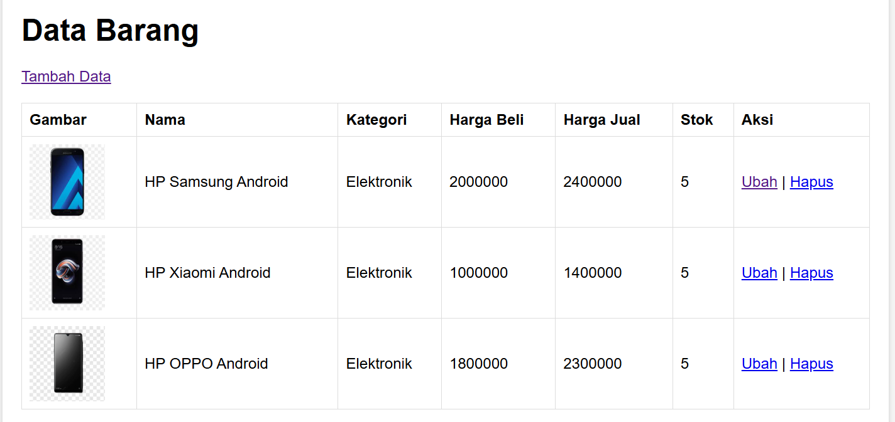

## LAPORAN PRAKTIKUM 8 — PHP & MySQL (CRUD)

## 1. Tujuan Praktikum
### Praktikum ini bertujuan untuk memahami:
**1. Konsep dasar database MySQL.**
**2. Cara membuat koneksi PHP–MySQL.**
**3. Implementasi CRUD (Create, Read, Update, Delete).**
**4. Mengupload file (gambar) melalui PHP.**
**5. Membuat aplikasi sederhana data barang seperti pada modul praktikum**

## 2. Persiapan Praktikum
Sebelum memulai, lakukan langkah berikut:
- Install XAMPP.
- Jalankan Apache & MySQL.
- Pastikan folder htdocs dapat digunakan untuk menyimpan file project.
- Pastikan phpMyAdmin dapat dibuka melalui http://localhost/phpmyadmin/

Screenshot:


## 3. Membuat Database & Tabel
Masuk ke phpMyAdmin → klik *New* → buat database dengan nama:

### latihan1

Setelah database dibuat, jalankan perintah SQL berikut:

```
CREATE TABLE data_barang (
  id_barang int(10) auto_increment PRIMARY KEY,
  kategori varchar(30),
  nama varchar(30),
  gambar varchar(100),
  harga_beli decimal(10,0),
  harga_jual decimal(10,0),
  stok int(4)
);
```

Tabel ini akan digunakan aplikasi CRUD untuk menyimpan data barang seperti nama, kategori, harga beli, harga jual, stok, dan gambar (path file).

Screenshot:


## 4. File koneksi.php
File ini digunakan agar aplikasi PHP dapat terhubung dengan MySQL.

```
<?php
$host = "localhost";
$user = "root";
$pass = "";
$db   = "latihan1";

$conn = mysqli_connect($host, $user, $pass, $db);
if (!$conn) {
    die("Koneksi gagal!");
} else {
    echo "Koneksi berhasil";
}
?>
```

Screenshot:


## 5. Halaman index.php (READ DATA)
Halaman ini menampilkan seluruh data barang dari database dalam bentuk tabel.

Fitur:
- Menampilkan gambar barang
- Menampilkan kategori, nama, harga, dan stok
- Tombol **Ubah**
- Tombol **Hapus**
- Tombol **Tambah Data**

Screenshot:


##  6. Halaman tambah.php (CREATE DATA)
Halaman ini digunakan untuk menambahkan data baru.

Fungsi:
- Mengisi form nama barang, kategori, harga beli, harga jual, stok
- Upload file gambar
- Menyimpan data ke database

Jika berhasil, user akan diarahkan kembali ke *index.php* dan data tampil di tabel.

Screenshot:


7. Halaman ubah.php (UPDATE DATA)
Halaman ini menampilkan data yang ingin diedit berdasarkan id_barang.

Fitur:
- Pre-filled form (data lama sudah muncul di textfield)
- User bisa mengganti gambar atau membiarkan yang lama
- Setelah disimpan, kembali ke index.php

Screenshot:


## 8. Membuat hapus.php (DELETE DATA)
File hapus.php berfungsi untuk menghapus 1 data barang dari database berdasarkan id_barang.

## 9. Struktur Folder Project
Struktur wajib agar upload gambar bekerja:

lab8_php_database/
│── index.php
│── tambah.php
│── ubah.php
│── hapus.php
│── koneksi.php
└── gambar/   

## 10. Kesimpulan
Membuat aplikasi CRUD data barang yang terdiri dari:
- Koneksi database
- Menampilkan data (READ)
- Menambah data (CREATE)
- Mengubah data (UPDATE)
- Menghapus data (DELETE)
- Upload gambar


